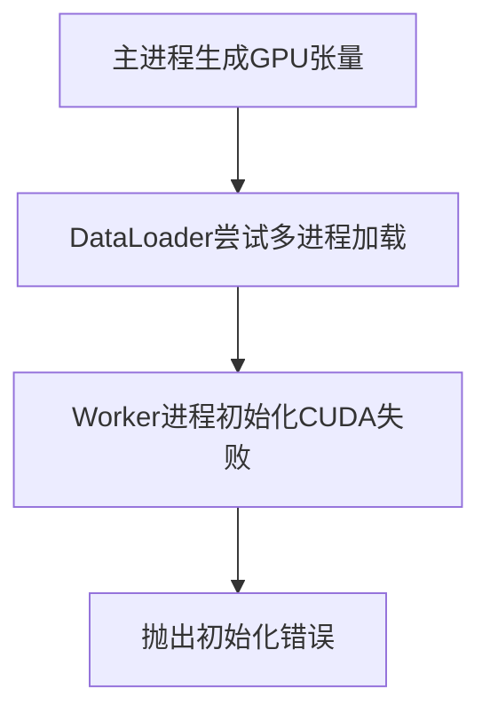

# PyTorch多进程数据加载与CUDA上下文管理

## 问题现象
当`DataLoader`的`num_workers > 0`时，出现运行时错误：
```python
RuntimeError: CUDA error: initialization error
```

## 根本原因

### 多进程工作机制
1. **Worker进程隔离性**：
   - 当`num_workers > 0`时，PyTorch会创建独立的Python工作进程
   - 每个worker进程拥有**独立的CUDA上下文**

2. **GPU张量的限制**：
   - 伪标签数据（`imgs`和`labs`）在主进程中生成并驻留在GPU上
   - Worker进程无法直接访问主进程的GPU内存空间

### 错误触发条件


## 解决方案

### 标准做法
```python
# 在创建数据集前显式移回CPU
imgs = imgs.cpu()  # 将图像数据移回CPU
labs = labs.cpu()  # 将标签数据移回CPU
```

### 原理说明
1. **CPU张量的优势**：
   - 可被序列化（pickle）
   - 支持跨进程安全传输
   - 每个worker可自主决定是否转移至GPU

2. **性能权衡**：
   - 增加CPU-GPU数据传输开销
   - 换取多进程并行加载的优势

## 特殊情况处理

### 当`num_workers=0`时
- ✅ **可以保留GPU张量**：
  - 数据加载发生在主进程
  - 无跨进程通信需求
  - 保持统一的CUDA上下文

- ⚠️ **但需注意**：
  ```python
  # 以下情况仍会报错：
  dataset = CustomDataset(gpu_tensor)  # 直接传入GPU张量
  loader = DataLoader(dataset, num_workers=0)  # 即使单进程也可能出现问题
  ```

## 最佳实践建议

1. **通用原则**：
   - 所有通过`DataLoader`传播的数据集应保持CPU张量形式
   - 在`__getitem__`方法内部执行GPU转移

2. **推荐代码结构**：
   ```python
   class SafeDataset(Dataset):
       def __init__(self, tensor_data):
           self.data = tensor_data.cpu()  # 初始化时强制转为CPU
       
       def __getitem__(self, idx):
           return self.data[idx].to(device)  # 按需转移到目标设备
   ```

3. **性能优化**：
   - 对于大规模数据：优先使用`pin_memory=True`
   - 平衡`num_workers`数量与内存消耗
---
另外很奇特的是：如果我不将imgs和labels放回cpu（伪标签生成函数中），并且设置num_workers为0时，程序仍会报错。
如下：

Epoch : 6
Generating pseudo-labels...
100%|█████████████████████████████████████████████████████████| 213/213 [00:24<00:00,  8.56it/s]
Pseudo-labels generated. len(Psedo_Label_Dataset) = 119
Training model...
  0%|                                                                    | 0/99 [00:00<?, ?it/s]
Traceback (most recent call last):
  File "/home/natsume/DeepL/DL2021/Homework/HW3/project3/src/main.py", line 61, in <module>
    train_loss, dev_loss = model.model_training(
  File "/home/natsume/DeepL/DL2021/Homework/HW3/project3/src/model.py", line 132, in model_training
    for data, label in tqdm(train_data):
  File "/home/natsume/DeepL/DL2021/Homework/HW3/project3/.venv/lib/python3.10/site-packages/tqdm/std.py", line 1181, in __iter__
    for obj in iterable:
  File "/home/natsume/DeepL/DL2021/Homework/HW3/project3/.venv/lib/python3.10/site-packages/torch/utils/data/dataloader.py", line 733, in __next__
    data = self._next_data()
  File "/home/natsume/DeepL/DL2021/Homework/HW3/project3/.venv/lib/python3.10/site-packages/torch/utils/data/dataloader.py", line 789, in _next_data
    data = self._dataset_fetcher.fetch(index)  # may raise StopIteration
  File "/home/natsume/DeepL/DL2021/Homework/HW3/project3/.venv/lib/python3.10/site-packages/torch/utils/data/_utils/fetch.py", line 55, in fetch
    return self.collate_fn(data)
  File "/home/natsume/DeepL/DL2021/Homework/HW3/project3/.venv/lib/python3.10/site-packages/torch/utils/data/_utils/collate.py", line 398, in default_collate
    return collate(batch, collate_fn_map=default_collate_fn_map)
  File "/home/natsume/DeepL/DL2021/Homework/HW3/project3/.venv/lib/python3.10/site-packages/torch/utils/data/_utils/collate.py", line 211, in collate
    return [
  File "/home/natsume/DeepL/DL2021/Homework/HW3/project3/.venv/lib/python3.10/site-packages/torch/utils/data/_utils/collate.py", line 212, in <listcomp>
    collate(samples, collate_fn_map=collate_fn_map)
  File "/home/natsume/DeepL/DL2021/Homework/HW3/project3/.venv/lib/python3.10/site-packages/torch/utils/data/_utils/collate.py", line 155, in collate
    return collate_fn_map[elem_type](batch, collate_fn_map=collate_fn_map)
  File "/home/natsume/DeepL/DL2021/Homework/HW3/project3/.venv/lib/python3.10/site-packages/torch/utils/data/_utils/collate.py", line 272, in collate_tensor_fn
    return torch.stack(batch, 0, out=out)
RuntimeError: Expected all tensors to be on the same device, but found at least two devices, cpu and cuda:0! (when checking argument for argument tensors in method wrapper_CUDA_cat)

### 询问gemini后得知：

即使 `num_workers` 设置为 0，仍然报错，是因为 `DataLoader` 在尝试将 `PseudoLabelDataset` 和原始 `train_dataset` 的数据合并成一个批次时，发现它们位于不同的设备上（CPU 和 CUDA:0）。

让我来详细解释一下：

1.  **`PseudoLabelDataset` 的数据来源**：
    在 `get_pseudo_labels_dataset` 函数中，当你执行 `imgs = data[mask]` 和 `labs = pseudo_labels[mask]` 时，如果 `data` 和 `pseudo_labels` 原本就在 GPU 上，那么 `imgs` 和 `labs` 也将保持在 GPU 上。你注释掉的那两行 `imgs = data[mask].cpu()` 和 `labs = pseudo_labels[mask].cpu()` 正是为了将它们移回 CPU。

2.  **`ConcatDataset` 的行为**：
    在 `generate_pseudo_labeled_data` 函数中，你创建了一个 `ConcatDataset`，它将 `train_dataset` 和 `pseudo_label_dataset` 合并在一起。

3.  **`DataLoader` 的批处理机制**：
    当 `DataLoader` 从 `ConcatDataset` 中获取数据时，它会尝试从这两个子数据集中分别获取样本，并将它们堆叠（stack）成一个批次。问题就出在这里：

      * `train_dataset` 中的数据（通过 `dataProcess.create_dataset` 加载）在通过 `transforms.ToTensor()` 转换后，默认是在 CPU 上的。
      * `pseudo_label_dataset` 中的 `imgs` 和 `labs` 如果没有被显式地移回 CPU，它们仍然在 GPU 上。

4.  **`RuntimeError: Expected all tensors to be on the same device, but found at least two devices, cpu and cuda:0!`**
    当 `DataLoader` 尝试将一个批次中的所有张量堆叠在一起时（通常通过 `torch.stack` 或类似的内部操作），它要求所有张量都位于同一个设备上。因为你的 `ConcatDataset` 中包含了来自 CPU（原始训练数据）和 GPU（伪标签数据）的张量，所以 `DataLoader` 无法将它们合并成一个批次，从而抛出了这个 `RuntimeError`。

**解决方案：**
即使 `num_workers` 是 0，你也需要确保 `PseudoLabelDataset` 中的图像和标签数据是在 CPU 上的，以便与原始 `train_dataset` 中的 CPU 数据保持一致。

你需要取消对 `imgs = data[mask].cpu()` 和 `labs = pseudo_labels[mask].cpu()` 这两行的注释，强制将伪标签数据移回 CPU。

```python
def get_pseudo_labels_dataset(dataset: Dataset, model: MyModel):
    # ... (前面的代码不变)
    if mask.any():
        # --这里一定要将数据重新放回cpu:
        # model_training()中使用了num_workers>0的DataLoader
        # 这会导致数据在GPU上，无法直接使用
        # 需要将数据放回CPU
        imgs = data[mask].cpu()  # [n_i, C, H, W]
        labs = pseudo_labels[mask].cpu()  # [n_i]
        all_imgs.append(imgs)
        all_labels.append(labs)
    # ... (后面的代码不变)
```

通过这样做，`PseudoLabelDataset` 中存储的数据将全部位于 CPU 上，这样当 `DataLoader` 尝试将它与原始的 CPU `train_dataset` 合并时，所有张量都将在同一个设备上，从而解决这个 `RuntimeError`。

---
### 所以所有dataloader（还是dataset?)的数据默认都是要放在cpu上的，报错是因为两者（伪标签和原始数据）不在同一设备上？

是的，你的理解非常准确。

所有 `DataLoader` (或者更准确地说，所有通过 `DataLoader` 加载并一起批处理的 `Dataset` 中的数据) 在进行批处理操作时，都期望批次内的所有张量位于**同一个设备**上。

你遇到的报错正是因为：
* **原始训练数据 (`train_dataset`)**：在你目前的 `dataProcess.py` 代码中，通过 `DatasetFolder` 加载的图像经过 `transforms.ToTensor()` 后，默认是在 CPU 上的。
* **伪标签数据 (`pseudo_label_dataset`)**：当你从 GPU 上的 `data` 和 `pseudo_labels` 直接切片得到 `imgs` 和 `labs` 时，如果没有 `.cpu()` 操作，这些伪标签数据会保留在 GPU 上。
* **`ConcatDataset` 和 `DataLoader`**：当 `ConcatDataset` 将这两部分数据合并，并由 `DataLoader` 尝试生成批次时，它发现同一个批次中既有 CPU 上的张量，又有 GPU 上的张量，因此会抛出 `RuntimeError: Expected all tensors to be on the same device, but found at least two devices, cpu and cuda:0!` 的错误。

所以，为了让 `DataLoader` 能够成功地将这些数据合并成批次，你需要确保 `PseudoLabelDataset` 中的数据在添加到 `ConcatDataset` 之前就已经移动到了 CPU 上，使其与原始 `train_dataset` 中的数据设备一致。
