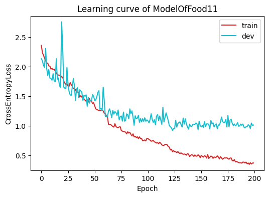
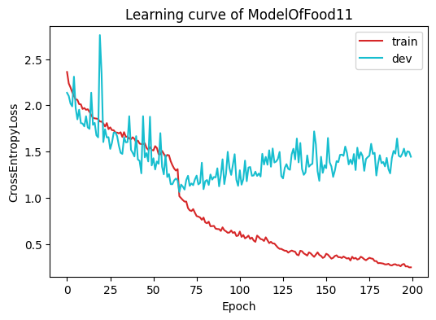
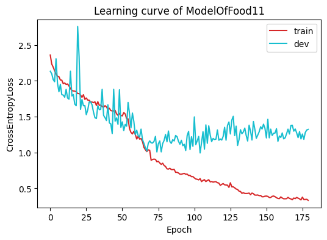
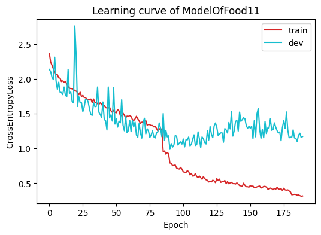
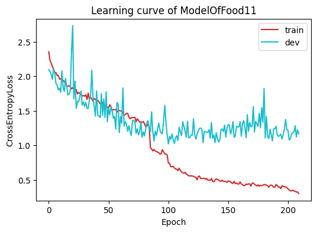
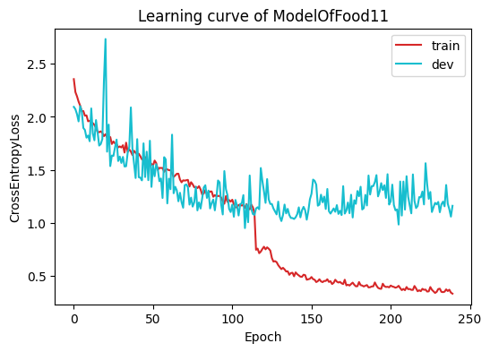
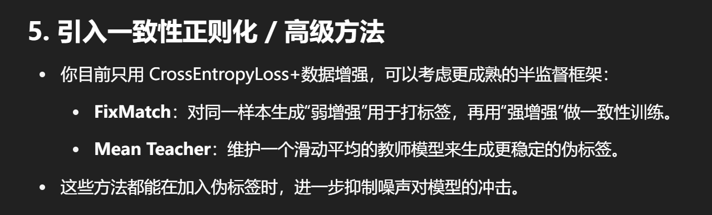
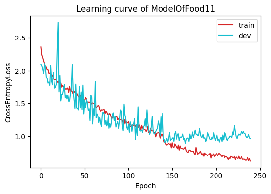
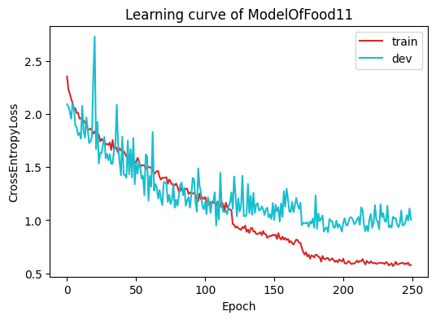
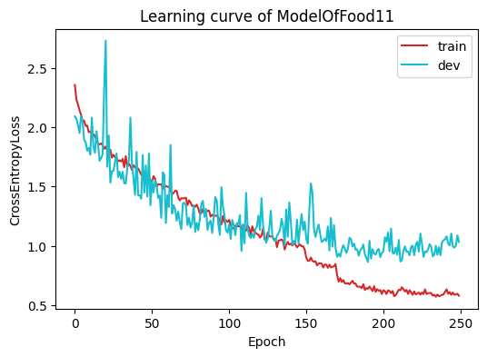

# 模型调参记录

## 2025/7/8

### Attemp-1.
使用拓展了网络深度的模型，发现总共200轮的epoch在80轮左右的时候，trainAcc就稳定超出validAcc大概10%的数值了，参考了网络资料初步认为是这四个问题
(a).前期伪标签数据投入过早
(b).伪标签阈值过低
(c).dropout等技术使用效率过低
(d).unlabeleddata的数据增强过强

本次训练的结果为：
Last-Epoch：
Train_loss: 0.372557, Train Acc: 0.889788. | Dev_loss: 1.013214, Dev Acc: 0.736364
Best-Acc：
Training finished! Best epoch: 197, with highest val_accuracy: 0.753030

---

### Attemp-2.
2-1：参数变化：提升了半监督开始的轮数和间隔数，减弱了伪标签数据的数据增广
2-2：训练过程记录：60轮左右valid acc仍稳定高于train acc约5%，但是加入伪标签数据后train acc迅速增长并超过valid acc约8%，后在80轮左右稳定超出10%左右。
2-3：猜想：怀疑是阈值过低的问题。

本次训练的结果为：
Last-Epoch：
Train_loss: 0.248292, Train Acc: 0.918505. | Dev_loss: 1.443861, Dev Acc: 0.722727
Best-Acc：
Training finished! Best epoch: 188, with highest val_accuracy: 0.731818

网络参数：
  MAX_EPOCH = 200
  BATCH_SIZE = 32
  SEMI_EPOCH = 60
  LEARNING_RATE = 0.0006
  SCHEDULER_STEP = 60
  NUM_WORKERS = 8
  WEIGHT_DECAY = 1e-4
  THRESHOLD = 0.85
  PSEUDO_INTERVAL = 5

---

### Attemp-3.
3-1：参数变换：略微降低了半监督开始的轮数，将学习率调度器的间隔略微增大，增大了伪标签阈值。
另外，由于训练在很早就稳定下来，略微降低了总轮数。
3-2：训练过程记录：60轮左右两个acc直接差距不大，大约在65%左右徘徊.70轮以后出现明显过拟合趋势，trainAcc大概高出8%左右
3-3：猜想：也许等原始数据对模型的提升不大时再加入数据会好一些吗？

本次训练的结果为：
Last-Epoch：
Train_loss: 0.332865, Train Acc: 0.894717. | Dev_loss: 1.323015, Dev Acc: 0.701515
Best-Acc：
Training finished! Best epoch: 151, with highest val_accuracy: 0.719697

网络参数：
  MAX_EPOCH = 180
  BATCH_SIZE = 32
  SEMI_EPOCH = 50
  LEARNING_RATE = 0.0006
  SCHEDULER_STEP = 65
  NUM_WORKERS = 8
  WEIGHT_DECAY = 1e-4
  THRESHOLD = 0.92
  PSEUDO_INTERVAL = 5

---

### Attemp-4.
4-1：参数变换：提高了半监督开始的轮数（30），将学习率调度器的间隔略微增大。
略微增加了总轮数。
4-2：训练过程记录：80轮左右两个acc接近，在读取伪标签数据后trainAcc提高10%左右，两者相差acc也在10%左右，但是短时间内valid acc有提高（30轮内）。但是从118-154这段训练过程中validAcc没有突破。
4-3：猜想：可以按照之前的思路，让两个acc训练差距不大时再加入伪标签数据。之后的训练考虑加大权重衰减，下一次训练先考虑将学习率调度器的间隔轮数调高。

本次训练的结果为：
Last-Epoch（189）：
Train_loss: 0.317122, Train Acc: 0.899381. | Dev_loss: 1.169844, Dev Acc: 0.719697
Best-Acc：
Training finished! Best epoch: 186, with highest val_accuracy: 0.728788
训练总时长：
Total training time: 1763.71 seconds

网络参数：
  MAX_EPOCH = 190
  BATCH_SIZE = 32
  SEMI_EPOCH = 80
  LEARNING_RATE = 0.0006
  SCHEDULER_STEP = 90
  NUM_WORKERS = 8
  WEIGHT_DECAY = 1e-4
  THRESHOLD = 0.92
  PSEUDO_INTERVAL = 5

---

### Attemp-5.
5-1：参数变换：增大了学习率调度器的间隔次数，为了体现调度器作用顺带提高了其总轮数。提高了WEIGHT_DECAY。
5-2：训练过程记录：加入伪标签数据前validAcc大约高出7%左右，加入后两者大概持平且trainAcc上涨10%左右
5-3：猜想：仍可提高进入半监督前的轮数，考虑加强标记数据的数据增广。下次训练只改变轮数来观察效果。

本次训练的结果为：
Last-Epoch：
Train_loss: 0.299726, Train Acc: 0.904303. | Dev_loss: 1.165642, Dev Acc: 0.68939
Best-Acc：
Training finished! Best epoch: 162, with highest val_accuracy: 0.730303
训练总时长：
Total training time: 00:33:50

网络参数：
  MAX_EPOCH = 210
  BATCH_SIZE = 32
  SEMI_EPOCH = 80
  LEARNING_RATE = 0.0006
  SCHEDULER_STEP = 100
  NUM_WORKERS = 8
  WEIGHT_DECAY = 2e-4
  THRESHOLD = 0.92
  PSEUDO_INTERVAL = 5

---

### Attemp-6.
6-1：参数变换：提高了训练轮数和半监督学习的开始轮数，提高了学习率调度器的间隔数
6-2：训练过程记录：
上轮的推测有局限，训练的难度应该更偏向**如何运用半监督数据**，但是按照上轮的结论改善了过拟合的情况。和前5次尝试一样，每次一添加伪标签数据训练Acc就猛涨（至少10%）。
6-3：猜想：
(a).训练阈值还不够高
(b).伪标签数据的transforms应该放在赋予标签函数之后而不是之前
下次训练决定同时研究两种解决方案

本次训练的结果为：
Last-Epoch：
Train_loss: 0.332990, Train Acc: 0.895891. | Dev_loss: 1.161178, Dev Acc: 0.704545
Best-Acc：
Training finished! Best epoch: 206, with highest val_accuracy: 0.734848
训练总时长：
Total training time: 00:38:10

网络参数：
  MAX_EPOCH = 240
  BATCH_SIZE = 32
  SEMI_EPOCH = 110
  LEARNING_RATE = 0.0006
  SCHEDULER_STEP = 125
  NUM_WORKERS = 8
  WEIGHT_DECAY = 2e-4
  THRESHOLD = 0.92
  PSEUDO_INTERVAL = 5

---

>**从本次实验开始程序修改逻辑：**
>a.在检验伪标签数据前统一做数据增强
>-------------->
>b.对未经检验的伪标签数据不做数据增强，对突破阈值的伪标签数据做数据增强

### Attemp-7.
7-1：参数变换：转换了数据增强的方式，未改变参数
7-2：训练过程记录：还是一加入数据validAcc基本不变，train_acc大幅增加。加入后约20轮才有第一次max valid acc，且此时train acc高出15%左右。
7-3：猜想：再把数据增广调大点试试？增大阈值？（好像是因为pseudoDataset里的程序错误导致了transform没起作用？下次训练检验）

实验运行中的猜想：
由于transform的问题，中断了本次运行的实验
但是重新实验的acc值好像并没有什么改变，只能说是trainacc没有涨的那么快了（原来迅速涨至85%左右，现在停留在77%左右），validacc好像没什么变化。
(a).是不是semi-supervised这一模块写的有问题？
(b).是伪标签间隔太短了？
下一次实验将do_semi_supervised设为False

本次训练的结果为：
Last-Epoch：
Train_loss: 0.589825, Train Acc: 0.810025. | Dev_loss: 0.889322, Dev Acc: 0.737879
**Best-Acc：**
Training finished! Best epoch: 197, with highest val_accuracy: 0.739394
训练总时长：
Total training time: 00:34:11

实验运行后的结论：
还是有显著进步的
160轮后，trainAcc不像前7次一样随便上升到80%，且validAcc基本稳定在70%以上。
**下次实验将do_semi_supervised设为False来找到从大概多少epoch开始有标记数据无法起作用**

网络参数：
  MAX_EPOCH = 240
  BATCH_SIZE = 32
  SEMI_EPOCH = 110
  LEARNING_RATE = 0.0006
  SCHEDULER_STEP = 125
  NUM_WORKERS = 8
  WEIGHT_DECAY = 2e-4
  THRESHOLD = 0.92
  PSEUDO_INTERVAL = 5

---

### Attemp-8.
8-1：参数变换：不改变任何参数看看不采用半监督的极限
8-2：训练过程记录：
8-3：猜想：感觉在130轮左右到极限？

本次训练的结果为：
Last-Epoch：
Train_loss: 0.619698, Train Acc: 0.799675. | Dev_loss: 0.963281, Dev Acc: 0.709091
**Best-Acc：**
Training finished! Best epoch: 203, with highest val_accuracy: 0.734848
训练总时长：
Total training time: 00:22:59

网络参数：
  MAX_EPOCH = 240
  BATCH_SIZE = 32
  SEMI_EPOCH = 109
  LEARNING_RATE = 0.0006
  SCHEDULER_STEP = 140
  NUM_WORKERS = 8
  WEIGHT_DECAY = 2e-4
  THRESHOLD = 0.95
  PSEUDO_INTERVAL = 5
  do_semi_supervised = False

---

### Attemp-9.
9-1：参数变换：总轮数 半监督开始数 半监督间隔数
9-2：训练过程记录：TrainAcc和ValidAcc之间的差距进一步缩小，170轮时仍只有7%左右（TrainAcc较大），相较于之前的13%来说有长足进步
9-3：猜想：……valid集的震荡太大了，下一次的测试用数据增广扩大valid集

本次训练的结果为：
Last-Epoch：
Train_loss: 0.577307, Train Acc: 0.814360. | Dev_loss: 1.004132, Dev Acc: 0.698485
**Best-Acc：**
Training finished! Best epoch: 200, with highest val_accuracy: 0.731818
训练总时长：
Total training time: 00:33:26

网络参数：
  MAX_EPOCH = 250
  BATCH_SIZE = 32
  SEMI_EPOCH = 119
  LEARNING_RATE = 0.0006
  SCHEDULER_STEP = 170
  NUM_WORKERS = 8
  WEIGHT_DECAY = 2e-4
  THRESHOLD = 0.95
  PSEUDO_INTERVAL = 30
  do_semi_supervised = True

## 2025/7/9

>本次实验开始使用数据增广手段将验证集扩充到原来的两倍

### Attempt-10.
10-1：参数变换：基本未变
10-2：训练过程记录：
10-3：猜想：

本次训练的结果为：
Last-Epoch：
Train_loss: 0.579619, Train Acc: 0.808985. | Dev_loss: 1.032107, Dev Acc: 0.714394
**Best-Acc：**
Training finished! Best epoch: 227, with highest val_accuracy: 0.737121
训练总时长：
Total training time: 00:33:53

网络参数：
  MAX_EPOCH = 250
  BATCH_SIZE = 32
  SEMI_EPOCH = 129
  LEARNING_RATE = 0.0006
  SCHEDULER_STEP = 170
  NUM_WORKERS = 8
  WEIGHT_DECAY = 2e-4
  THRESHOLD = 0.95
  PSEUDO_INTERVAL = 30
  do_semi_supervised = True

>将未经处理的训练数据和数据增广的数据相连

### Attempt-11.
11-1：参数变换：
11-2：训练过程记录：
11-3：猜想：应该是之前的数据增广做错了，20轮内valid_acc就涨到了60%，但是这次还没有加入伪标签数据TrainAcc就已经和之前的160轮左右一样高出10%左右了

本次训练的结果为：
Last-Epoch：

**Best-Acc：**

训练总时长：

网络参数：
  MAX_EPOCH = 200
  BATCH_SIZE = 32
  SEMI_EPOCH = 40
  LEARNING_RATE = 0.0006
  SCHEDULER_STEP = 110
  NUM_WORKERS = 8
  WEIGHT_DECAY = 2e-4
  THRESHOLD = 0.95
  PSEUDO_INTERVAL = 25
