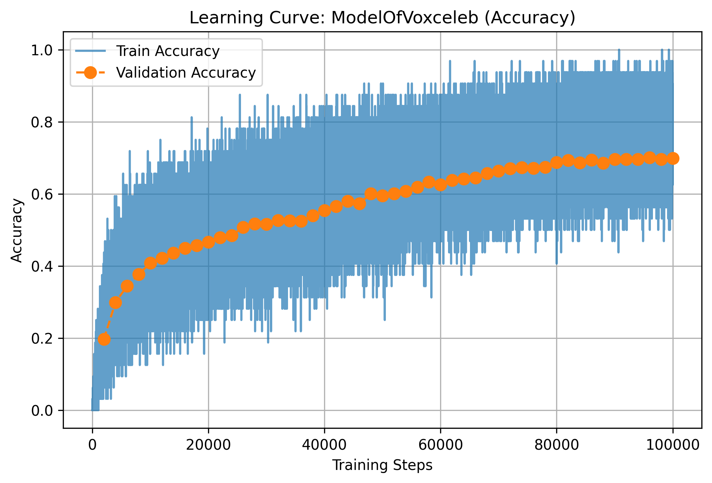
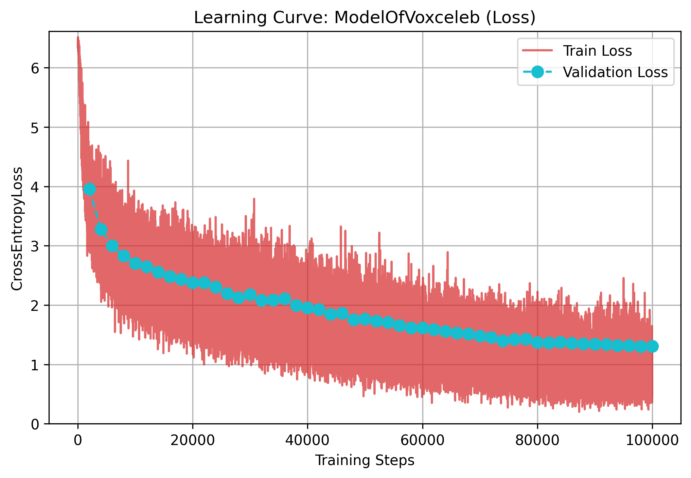
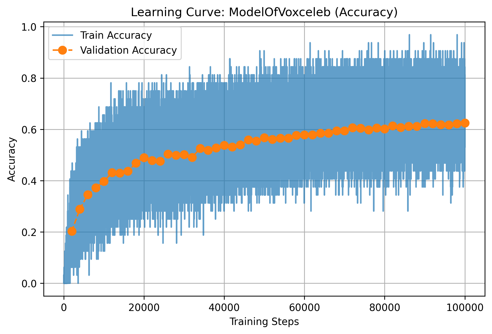
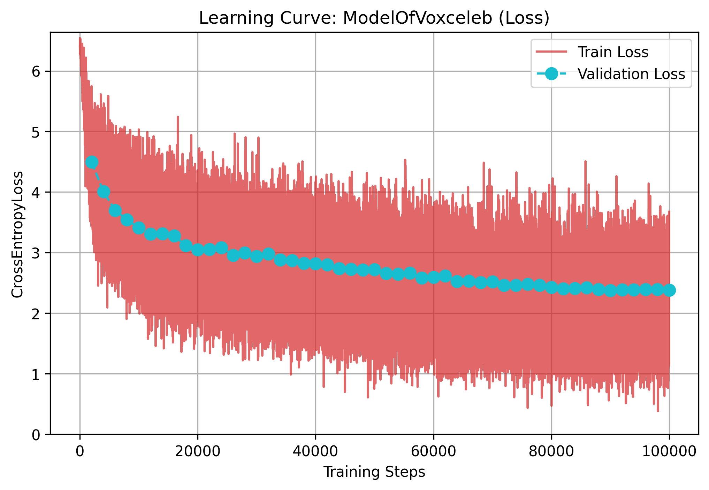
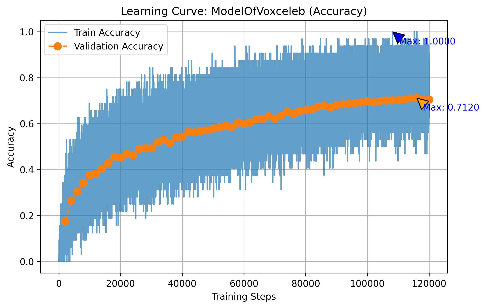
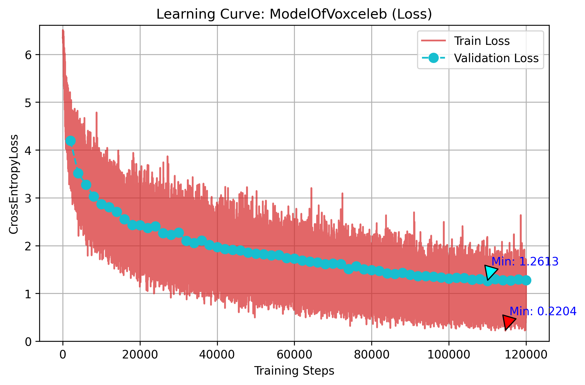
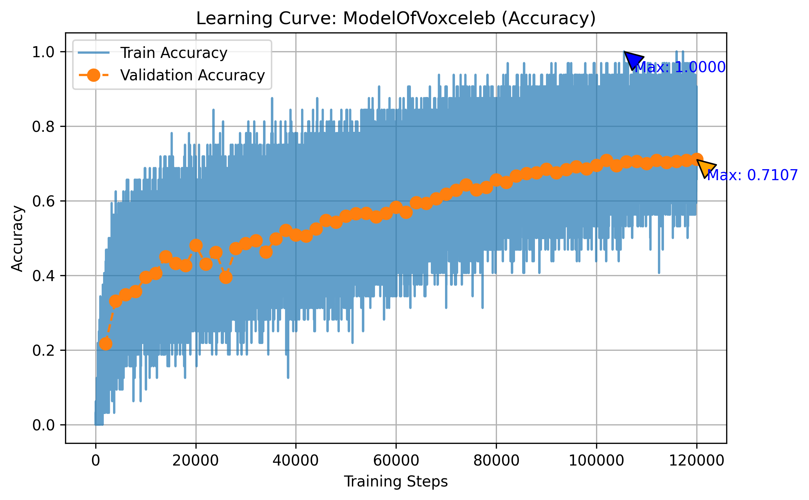
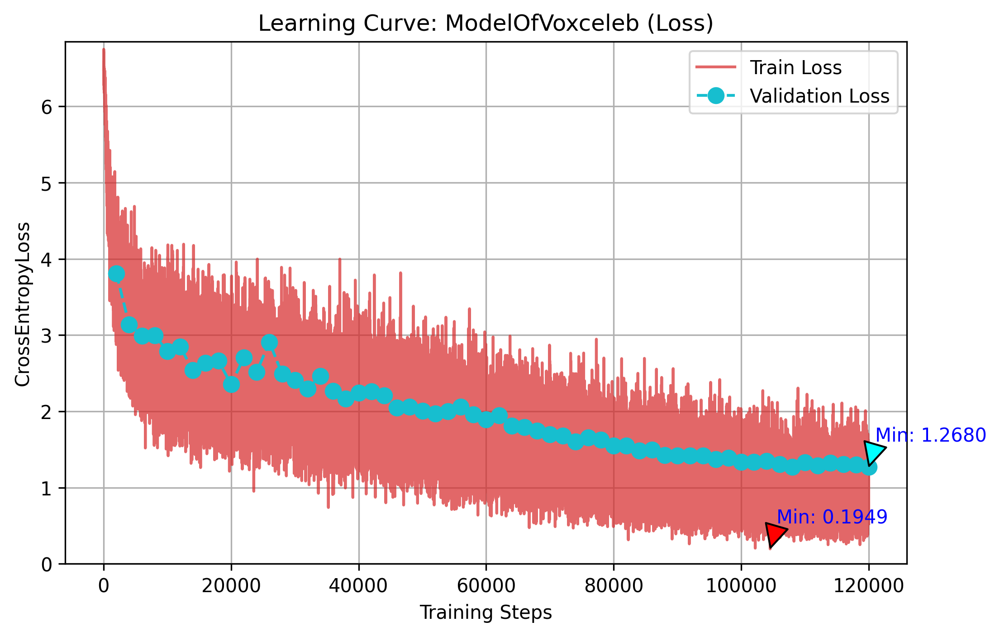

# 实验过程有关网络架构和参数设置的日志

---

### 2025/7/21

#### T01

在对sample code做基本调整的前提下将simple baseline的**理论要求**到达，但是实际的acc只达到约70%左右。仍在校验代码中。

##### 训练过程图示



<br>



```python
# 参数表
TRAIN_RATIO = 0.9
BATCH_SIZE = 32
NUM_WORKERS = 4
WARMUP_STEPS = 1000
VALID_STEPS = 2000
SAVED_STEPS = 10000
MAX_STEP = 100000
LEARNING_RATE = 0.002
WEIGHT_DECAY = 1e-4
```

---

#### T02

测试前：将模型架构修改成近似Medium Baseline的模式，期望能获得更高的成绩

测试结果：结果变差许多

变动范围：网络架构，具体如下

```python
    def __init__(self, d_model=80, n_spks=600, dropout=0.1):
        super().__init__()
        # Project the dimension of features from that of input into d_model.
        self.prenet = nn.Linear(40, d_model)
        self.encoder_layer = nn.TransformerEncoderLayer(
            d_model=d_model, dim_feedforward=256, nhead=1
        )

        # Project the the dimension of features from d_model into speaker nums.
        self.pred_layer = nn.Sequential(
            nn.Linear(d_model, n_spks),
            nn.ReLU(),
        )
```

##### 训练过程图示



<br>



```python
# 参数表（未变）
TRAIN_RATIO = 0.9
BATCH_SIZE = 32
NUM_WORKERS = 4
WARMUP_STEPS = 1000
VALID_STEPS = 2000
SAVED_STEPS = 10000
MAX_STEP = 100000
LEARNING_RATE = 0.002
WEIGHT_DECAY = 1e-4
```
---

#### T03

测试前：前一次的结果较预想来说下降不少，但是这又是pdf中的指示，怀疑是执行错误

测试结果：结果较之前的最好结果提高了1%左右，csv文件的预测分数为


变动范围：怀疑是全连接层的问题，还原了全连接层

```python
        self.pred_layer = nn.Sequential(
            nn.Linear(d_model, d_model),
            nn.ReLU(),
            nn.Linear(d_model, n_spks),
        )
```

##### 训练过程图示



<br>



```python
# 参数表（未变）
TRAIN_RATIO = 0.9
BATCH_SIZE = 32
NUM_WORKERS = 4
WARMUP_STEPS = 1000
VALID_STEPS = 2000
SAVED_STEPS = 10000
MAX_STEP = 100000
LEARNING_RATE = 0.002
WEIGHT_DECAY = 1e-4
```
---

### 2025/7/22

#### T04

测试结果：和上次几乎没有区别

变动范围：怀疑是上上次测试中未将全连接层的激活函数消去，按照如下进行测试

```python
        self.pred_layer = nn.Sequential(
            nn.Linear(d_model, n_spks),
        )
```

##### 训练过程图示



<br>



```python
# 参数表
TRAIN_RATIO = 0.9
BATCH_SIZE = 32
NUM_WORKERS = 4
WARMUP_STEPS = 1000
VALID_STEPS = 2000
SAVED_STEPS = 10000
MAX_STEP = 100000
LEARNING_RATE = 0.003
WEIGHT_DECAY = 1e-4
```
