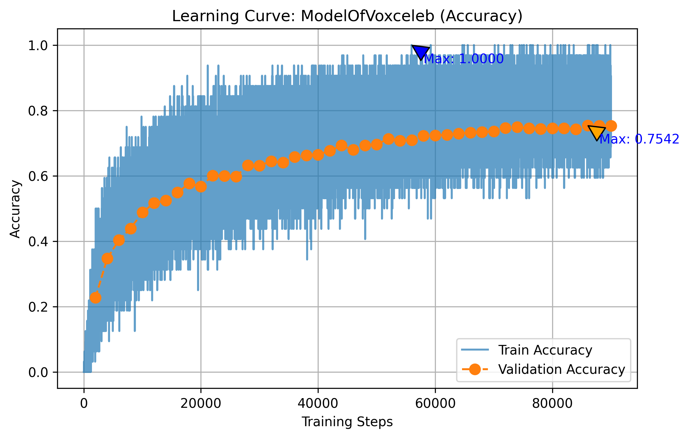
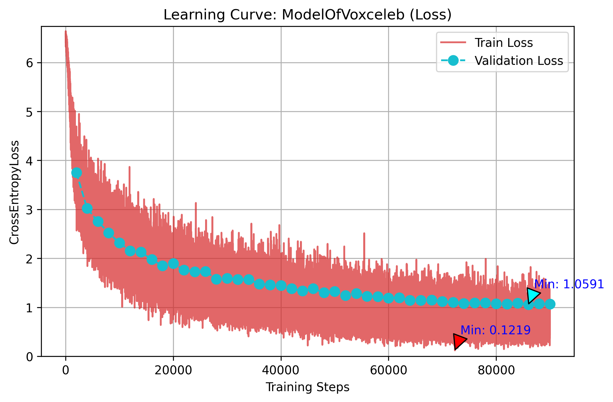
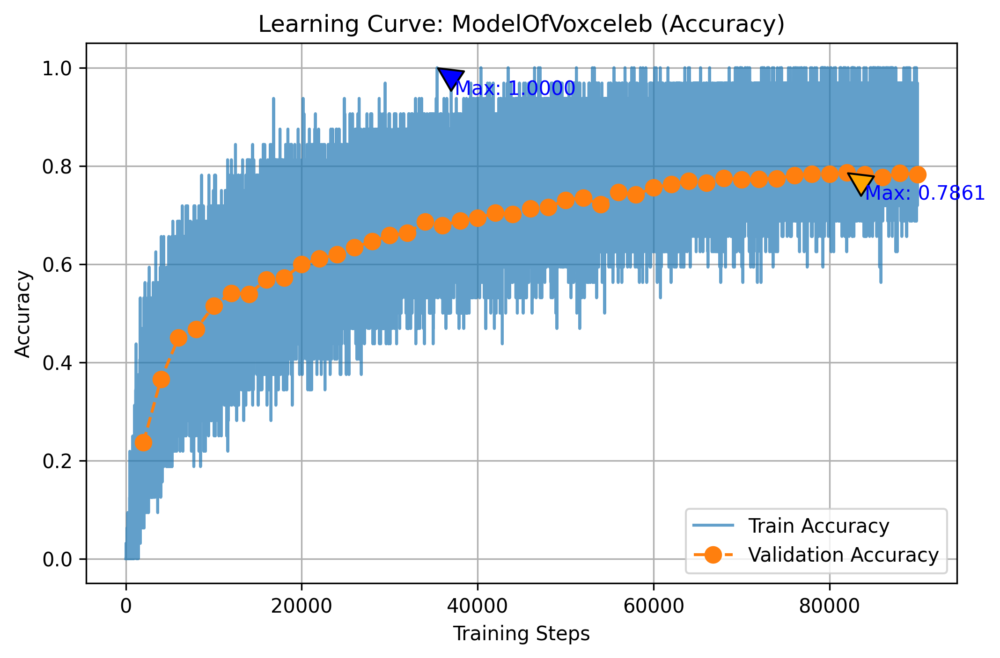
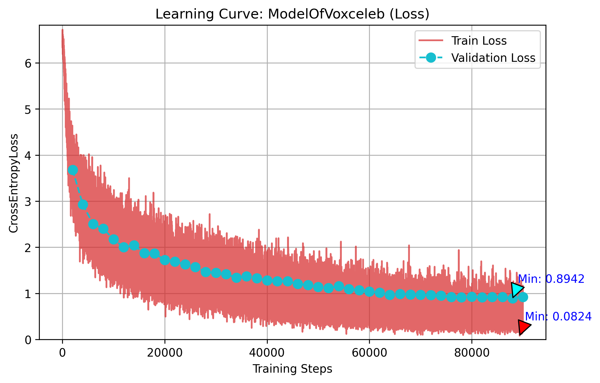
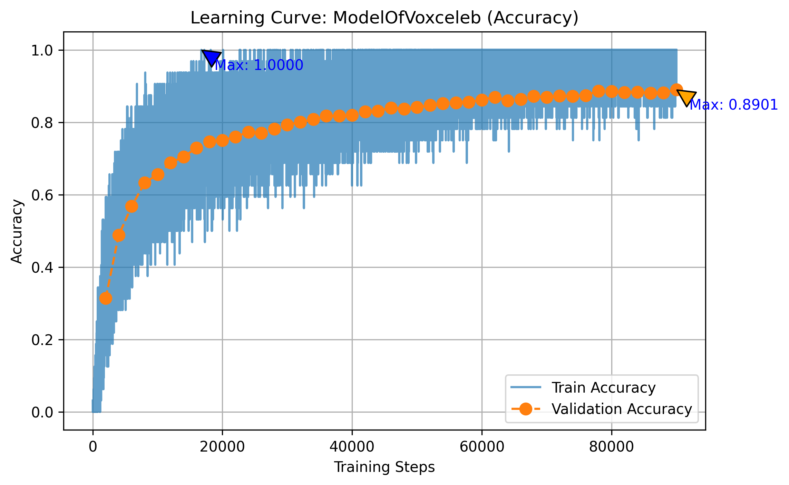
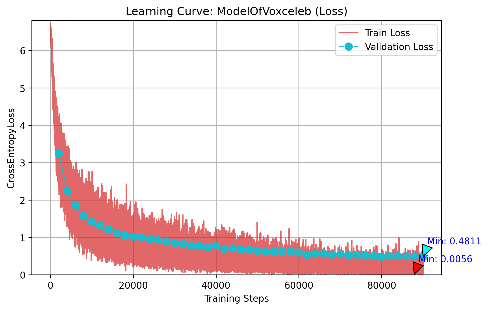

# 实验过程有关网络架构和参数设置的日志

---

### 2025/7/21

#### T01

在对sample code做基本调整的前提下将simple baseline的**理论要求**到达，但是实际的acc只达到约70%左右。仍在校验代码中。

##### 训练过程图示


<br>


```python
# 参数表
TRAIN_RATIO = 0.9
BATCH_SIZE = 32
NUM_WORKERS = 4
WARMUP_STEPS = 1000
VALID_STEPS = 2000
SAVED_STEPS = 10000
MAX_STEP = 100000
LEARNING_RATE = 0.002
WEIGHT_DECAY = 1e-4
```

---

#### T02

测试前：将模型架构修改成近似Medium Baseline的模式，期望能获得更高的成绩

测试结果：结果变差许多

变动范围：网络架构，具体如下

```python
    def __init__(self, d_model=80, n_spks=600, dropout=0.1):
        super().__init__()
        # Project the dimension of features from that of input into d_model.
        self.prenet = nn.Linear(40, d_model)
        self.encoder_layer = nn.TransformerEncoderLayer(
            d_model=d_model, dim_feedforward=256, nhead=1
        )

        # Project the the dimension of features from d_model into speaker nums.
        self.pred_layer = nn.Sequential(
            nn.Linear(d_model, n_spks),
            nn.ReLU(),
        )
```

##### 训练过程图示


<br>


```python
# 参数表（未变）
TRAIN_RATIO = 0.9
BATCH_SIZE = 32
NUM_WORKERS = 4
WARMUP_STEPS = 1000
VALID_STEPS = 2000
SAVED_STEPS = 10000
MAX_STEP = 100000
LEARNING_RATE = 0.002
WEIGHT_DECAY = 1e-4
```
---

#### T03

测试前：前一次的结果较预想来说下降不少，但是这又是pdf中的指示，怀疑是执行错误

测试结果：结果较之前的最好结果提高了1%左右，csv文件的预测分数为


变动范围：怀疑是全连接层的问题，还原了全连接层

```python
        self.pred_layer = nn.Sequential(
            nn.Linear(d_model, d_model),
            nn.ReLU(),
            nn.Linear(d_model, n_spks),
        )
```

##### 训练过程图示


<br>


```python
# 参数表（未变）
TRAIN_RATIO = 0.9
BATCH_SIZE = 32
NUM_WORKERS = 4
WARMUP_STEPS = 1000
VALID_STEPS = 2000
SAVED_STEPS = 10000
MAX_STEP = 100000
LEARNING_RATE = 0.002
WEIGHT_DECAY = 1e-4
```
---

### 2025/7/22

#### T04

测试结果：和上次几乎没有区别

变动范围：怀疑是上上次测试中未将全连接层的激活函数消去，按照如下进行测试

```python
        self.pred_layer = nn.Sequential(
            nn.Linear(d_model, n_spks),
        )
```

##### 训练过程图示


<br>


```python
# 参数表
TRAIN_RATIO = 0.9
BATCH_SIZE = 32
NUM_WORKERS = 4
WARMUP_STEPS = 1000
VALID_STEPS = 2000
SAVED_STEPS = 10000
MAX_STEP = 100000
LEARNING_RATE = 0.003
WEIGHT_DECAY = 1e-4
```

---

### 2025/7/23

短报：在扩大d_model（模型架构中/与实验文件描述相反）的情况下成绩居然还略有提升



<br>



<br>


按照这个逻辑继续扩大尝试。

最后暂定d_model=150。

---

### 2025/7/24

#### T05

测试前：完成了self-attentive pooling（作业文件中的hint），替代了原有的平均池化

测试结果：csv文件的预测分数如下，由训练图中可以看到明显的过拟合趋势


代码变动：如下

```python
# 引入新模块
class SelfAttentionPooling(nn.Module):
    def __init__(self, input_dim):
        super(SelfAttentionPooling, self).__init__()
        self.W = nn.Linear(
            input_dim, input_dim
        )
        self.v = nn.Parameter(torch.rand(input_dim))

    def forward(self, x, mask=None):
        attn_scores = torch.tanh(self.W(x))

        attn_scores = torch.matmul(attn_scores, self.v)

        if mask is not None:
            attn_scores = attn_scores.masked_fill(
                mask == 0, -1e9
            )  # mask should be (batch_size, sequence_length)

        attn_weights = torch.softmax(attn_scores, dim=1)

        attn_weights = attn_weights.unsqueeze(2)
        pooled_output = torch.sum(x * attn_weights, dim=1)

        return pooled_output, attn_weights
```

##### 训练过程图示



<br>



```python
# 参数表（未变）
TRAIN_RATIO = 0.9
BATCH_SIZE = 32
NUM_WORKERS = 8
WARMUP_STEPS = 1000
VALID_STEPS = 2000
SAVED_STEPS = 10000
MAX_STEP = 90000
LEARNING_RATE = 0.001
WEIGHT_DECAY = 1e-4
```

---

### 2025/7/27

#### T06

测试前：完成了conformer模块，替换了原有的transformer模块

测试结果：valid_acc以远快于原有模型的速度增长（快到让我以为存在数据泄露，但是实际上更改部分只在model.py内）。大概为31->48->56->63（8000step内），所以之后的实验暂且将总step调低了一些。另外，原作业文件推荐的三个hint还有一个没有实现就已经达到了双strong baseline有点出乎意料（还以为肯定是哪里出错了导致的训练飞涨）

kaggle成绩：


代码变动：如下
```python
class Conformer(nn.Module):
    def __init__(
        self, input_dim, dim_feedforward=256, dropout=0.1, kernel_size=3, nhead=8
    ):  # 此处的kernel_size没用到，但是原论文中建议设置为较大的kernel size
        super().__init__()
        self.layer_norm = nn.LayerNorm(input_dim)
        self.feed_forward = FeedForward(input_dim, dim_feedforward, dropout)
        self.self_attention = MultiheadSelfAttention(
            input_dim, num_heads=nhead, dropout=dropout
        )
        self.convolution = ConvolutionModule(input_dim)

    def forward(self, x):
        x = self.feed_forward(x)
        x = self.self_attention(x)  # out: torch.Size([32, 128, 160])
        x = self.convolution(x)
        x = self.feed_forward(x)
        x = self.layer_norm(x)
        return x


class FeedForward(nn.Module):
    def __init__(self, input_dim, dim_feedforward=256, dropout=0.1):
        super().__init__()
        self.layer_norm = nn.LayerNorm(input_dim)
        self.linear1 = nn.Linear(input_dim, dim_feedforward)
        self.linear2 = nn.Linear(dim_feedforward, input_dim)
        self.swish = nn.SiLU()
        self.dropout = nn.Dropout(dropout)

    def forward(self, x):
        residual = x
        x = self.layer_norm(x)
        x = self.linear1(x)
        x = self.swish(x)
        x = self.dropout(x)
        x = self.linear2(x)
        # x = self.swish(x)  # 按照原论文不需要二次激活
        x = self.dropout(x)
        return 0.5 * x + residual


class MultiheadSelfAttention(nn.Module):
    def __init__(self, input_dim, num_heads, dropout=0.1):
        super().__init__()
        self.layer_norm = nn.LayerNorm(input_dim)
        self.attention = nn.MultiheadAttention(
            embed_dim=input_dim, num_heads=num_heads, batch_first=True
        )
        self.dropout = nn.Dropout(dropout)

    def forward(self, x):
        residual = x
        x = self.layer_norm(x)
        x, _ = self.attention(x, x, x)
        x = self.dropout(x)
        return x + residual


class ConvolutionModule(nn.Module):
    def __init__(self, input_dim, kernel_size=3, padding=1):
        super().__init__()
        self.layer_norm = nn.LayerNorm(input_dim)
        # self.pointwise_conv = nn.Conv1d(
        #     input_dim, 2 * input_dim, kernel_size=kernel_size, padding=padding
        # )  # 和下方的函数应该起的是一样的作用，因此选择下方的做法
        self.pointwise1 = nn.Linear(in_features=input_dim, out_features=input_dim * 2)
        self.pointwise2 = nn.Linear(in_features=input_dim, out_features=input_dim)
        self.glu = nn.GLU(dim=-1)
        self.depthwise_conv = nn.Conv1d(
            input_dim,
            input_dim,
            kernel_size=kernel_size,
            padding=padding,
            groups=input_dim,
        )
        self.batch_norm = nn.BatchNorm1d(input_dim)
        self.swish = nn.SiLU()
        self.Dropout = nn.Dropout(0.1)

    def forward(self, x):
        residual = x
        # x shape: (batch_size, input_dim, sequence_length)
        x = self.layer_norm(x)
        x = self.pointwise1(x)
        x = self.glu(x)  # Apply GLU activation(截断一半)
        x = x.transpose(1, 2)  # Change to (batch_size, sequence_length, input_dim)
        x = self.depthwise_conv(x)
        x = self.batch_norm(x)
        x = self.swish(x)
        x = x.transpose(1, 2)
        x = self.pointwise2(x)
        x = self.Dropout(x)

        return x + residual
```
##### 训练过程图示



<br>



<br>

>**训练结果**
>The highest valid accuracy is 0.8901209677419355
>Total training time: 00:17:04

```python
# 参数表
TRAIN_RATIO = 0.9
BATCH_SIZE = 32
NUM_WORKERS = 8
WARMUP_STEPS = 1000
VALID_STEPS = 2000
SAVED_STEPS = 10000
MAX_STEP = 90000
LEARNING_RATE = 0.001
WEIGHT_DECAY = 1e-4
add_valid_data_into_training = False
save_dir = "Homework/HW4/project4/saved_models"
output_path = "predict.csv"
NCOL = 90
```
