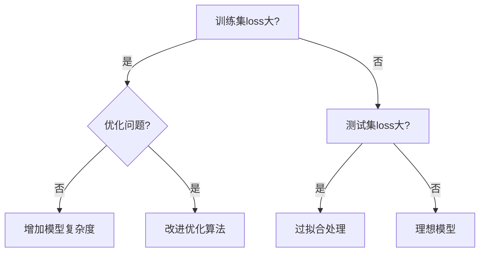

# Overfitting & ML Framework (v6) 学习笔记

## 1. 机器学习基础框架
### 1.1 数据划分
- **Training Data**: $\{(x^1, \hat{y}^1), ..., (x^N, \hat{y}^N)\}$
- **Testing Data**: $\{x^{N+1}, ..., x^{N+M}\}$

### 1.2 训练三步骤
1. **定义模型**: $y = f_\theta(x)$
2. **定义损失函数**: $L(\theta)$
3. **优化**: $\theta^* = \arg\min_\theta L$

## 2. 核心问题诊断
### 2.1 模型偏差 (Model Bias)
- **现象**: 训练集loss大
- **原因**: 模型太简单（如线性模型）
- **解决方案**:
  - 增加特征: $y = b + \sum w_j x_j$
  - 使用深度学习: $y = b + \sum c_i \cdot \text{sigmoid}(b_i + \sum w_{ij}x_j)$

### 2.2 优化问题 (Optimization Issue)
- **现象**: 训练集loss大但存在更好解
- **判断方法**: 先用浅层网络验证优化能力
- **解决方案**: 改进优化算法（如Adam, RMSProp）

### 2.3 过拟合 (Overfitting)
- **现象**: 训练集loss小，测试集loss大
- **极端案例**:
  ```math
  f(x) = \begin{cases} 
  \hat{y}^i & \exists x^i = x \\ 
  \text{random} & \text{otherwise}
  \end{cases}
  ```

## 3. 过拟合解决方案
| 方法                | 说明                                                                 | 图示示例                     |
|---------------------|----------------------------------------------------------------------|------------------------------|
| **数据增强**         | 通过变换生成更多训练数据（唯一可在作业中使用的方法）                  | Page 15                      |
| **简化模型**         | 减少参数/特征数量                                                   | Page 18                      |
| **正则化**           | 添加L1/L2约束                                                       |                              |
| **Dropout**          | 随机屏蔽神经元                                                      |                              |
| **Early Stopping**   | 提前终止训练                                                        |                              |

## 4. 偏差-复杂度权衡
- **关键曲线**:
  - Training loss 随模型复杂度↑单调↓
  - Testing loss 先↓后↑（最优复杂度在中间）
- **选择原则**: 根据validation set选择测试loss最低的模型

## 5. 作业注意事项
### 5.1 模型选择陷阱
- **Public/Private测试集差异**:
  - 在public set表现好≠private set好
  - 案例：TOP10→300+名（因过拟合public set）

### 5.2 交叉验证
- **推荐方法**: N-fold Cross Validation
  ```
  训练集 → 拆分为K个子集
  轮流用K-1个子集训练，1个子集验证
  取平均表现最佳模型
  ```
- **避免操作**: 直接用public测试集调参

## 6. 数据不匹配问题 (Mismatch)
- **特点**: 训练/测试数据分布不同（仅HW11会出现）
- **注意**: 单纯增加训练数据无效，需检查数据生成过程

## 7. 实例分析
- **YouTube观看量预测**:
  - 1~4层神经网络比较
  - 3层模型在测试集表现最佳（e=2.58k）

## 8. 综合决策流程图


> **关键参考文献**:
> - ResNet论文: http://arxiv.org/abs/1512.03385
> - Kaggle技巧: http://www.chioka.in/how-to-select-your-final-models-in-a-kaggle-competitio/
```
